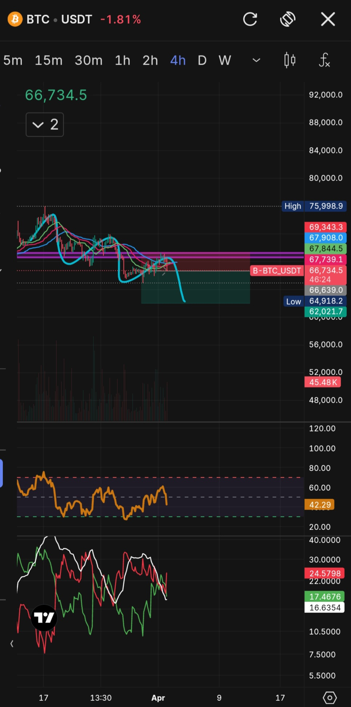

Bitcoin (BTC/USDT) Analysis

Timeframe:
4H (Short-term view)

Market Structure
- Forming lower highs and lower lows, indicating downtrend.
  
Indicators
- Williams Alligator: confirmation of downtrend 
- DMI: -Di>+Di indicating strong selling pressure.
  
External Factors:
Global geo-political uncertainty and crude oil volatility may increase market risk sentiment.

Key Levels:
Support: 62K
Next Support: 56K
Resistance: 67K–69K

Chart:

Conclusion:
Current bias is bearish. Price may retest 62K support.

Invalidation:
If price breaks above 69K, bearish view becomes invalid.
